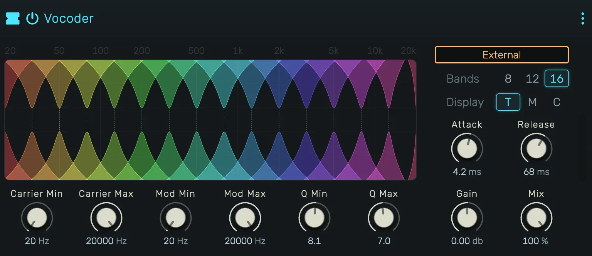

# Vocoder

A classic analysis/synthesis vocoder. The device splits two signals — a **carrier**
(the main device input) and a **modulator** — into parallel band-pass filters,
tracks the modulator's per-band amplitude with envelope followers, and uses those
envelopes to drive the gain of the matching carrier bands. The output is the
carrier "speaking" through the modulator.

Unlike most vocoders, the carrier and modulator frequency ranges are
**independent parameters**. You can stretch, compress, invert, or completely
reverse the mapping between them.

## Parameters

### Carrier Min / Carrier Max
Low and high frequency bounds of the carrier filter bank. 

### Mod Min / Mod Max
Low and high frequency bounds of the modulator filter bank. Swap or reverse
these relative to the carrier bounds to remap the spectral correspondence.

### Q Min / Q Max
Bandwidth range for the filters. Bands are spread exponentially between these
two Q values. Narrow Q (high number) gives sharper formants, wide Q (low number)
gives a smoother sound.

### Release
Release time of the envelope follower that tracks each modulator band. Short
values give a snappier, more intelligible result; long values smear and smooth.
Attack is fixed at 5 ms.

### Gain
Output gain applied after the vocoder processing.

### Mix
Dry/wet crossfade (equal-power). At 100 % the output is purely the vocoded
signal; at 0 % the carrier passes through unchanged.

### Bands (8 / 12 / 16)
Number of filter bands. 8 is warm and analog-like, 12 is balanced, 16 is more
articulate. Changes are click-free — switching mid-playback is safe.

### Source
Choose the modulator signal:

- **Noise — White / Pink / Brown**: built-in deterministic noise generators.
  Pink is the default and gives an immediately recognisable vocoder sound the
  moment the device is added to a track.
- **Self**: the carrier modulates itself. The device becomes a true multi-band
  gate — each band's gain follows its own carrier energy.
- **Tracks → …**: any audio output in the project. Route a vocal or drum track
  here for classic vocoder work.

## Tips

- For **spectrum reversal**, swap Mod Min and Mod Max (set Min to 12000 Hz,
  Max to 80 Hz) while keeping Carrier in the normal direction. You'll hear
  low-frequency modulator content drive the carrier's high bands and vice versa.
- **Self mode** on a bass line acts like a multi-band gate, tightening the
  transient shape of each frequency region independently.
- Use **16 bands** for intelligible vocals, **8 bands** for warmer or more
  vintage character.
- Changing band count, source, or any parameter during playback is safe — the
  DSP crossfades bands in and out over a few milliseconds to avoid clicks.
