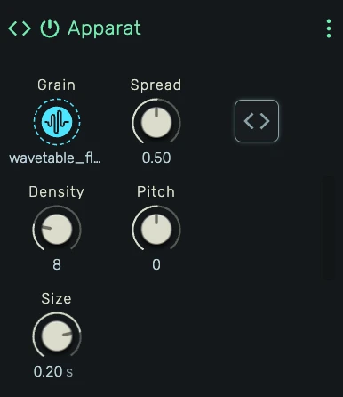

# Apparat

A programmable instrument that lets you write custom synthesizers and samplers in JavaScript. Generate audio from note events, load samples for granular synthesis, declare parameters with knobs, and hot-reload changes in real time.

---



---

## 0. Overview

_Apparat_ is a scriptable instrument device. You write a `Processor` class in JavaScript that receives note events and generates stereo audio. Parameters and samples declared in the code appear as automatable knobs and file pickers on the device panel.

Example uses:

- Custom synthesizers (additive, subtractive, FM, wavetable)
- Sample playback with pitch tracking
- Granular synthesis
- Algorithmic sound generators
- Prototyping new instrument ideas

---

## 1. Editor

Click the **Editor** button on the device panel to open the full-screen code editor. The editor uses Monaco (the engine behind VS Code) with JavaScript syntax highlighting.

The status bar at the bottom shows the current state:

- **Idle** — No compilation attempted yet
- **Successfully compiled** — Code compiled and loaded into the audio engine
- **Error message** — Syntax error, runtime error, or validation failure

---

## 2. Parameters

Declare parameters using `// @param` comments at the top of your code:

```javascript
// @param attack  0.01  0.001  1.0  exp  s
// @param release 0.3   0.01   2.0  exp  s
// @param mode    0     0      3    int
// @param bypass  false
```

Each `@param` directive creates an automatable knob on the device panel. The full syntax is:

```
// @param <name> [default] [min max type [unit]]
```

### Simple (unipolar)

```
// @param gain           → 0–1, default 0
// @param gain 0.5       → 0–1, default 0.5
```

### Mapped

```
// @param attack 0.01 0.001 1.0 exp s   → exponential 0.001–1.0, default 0.01
// @param mode 0 0 3 int                → integer 0–3, default 0
```

The knob displays the mapped value with the unit. `paramChanged` receives the mapped value directly.

### Boolean

```
// @param bypass false         → Off/On, default Off
// @param bypass true          → Off/On, default On
```

`paramChanged` receives `0` or `1`.

### Supported mapping types

| Type | Description | paramChanged receives |
|---|---|---|
| *(none)* | Unipolar 0–1 | `number` (0–1) |
| `linear` | Linear scaling between min and max | `number` (min–max) |
| `exp` | Exponential scaling (for frequency, time) | `number` (min–max) |
| `int` | Integer snapping between min and max | `number` (integer) |
| `bool` | On/Off toggle | `number` (0 or 1) |

Parameters are reconciled on each compile: new parameters are added, removed parameters are deleted, and existing parameters keep their current value. Multiple spaces between tokens are allowed for alignment.

---

## 3. Samples

Declare samples using `// @sample` comments:

```javascript
// @sample wavetable
// @sample grain
```

Each `@sample` creates a file picker on the device panel. Drag an audio file onto it or click to browse. The sample data is available in the processor as `this.samples.<name>`.

When loaded, `this.samples.wavetable` returns an `AudioData` object:

```javascript
{
    sampleRate: number,                       // original sample rate
    numberOfFrames: number,                   // number of frames
    numberOfChannels: number,                 // 1 (mono) or 2 (stereo)
    frames: [Float32Array, Float32Array]      // per-channel sample data
}
```

Returns `null` before the sample is loaded. Always check:

```javascript
const data = this.samples.grain
if (data === null) return
```

When playing back samples, account for sample rate differences between the sample and the project:

```javascript
const playbackRate = data.sampleRate / sampleRate
```

---

## 4. Keyboard Shortcuts

| Shortcut            | Action                              |
|---------------------|-------------------------------------|
| `Alt+Enter`         | Compile and run                     |
| `Ctrl+S` / `Cmd+S` | Compile, run, and save to project   |

---

## 5. Safety

The engine validates your output on every audio block:

- **NaN detection** — If any output sample is NaN, the processor is silenced and the error is reported.
- **Overflow protection** — If any sample exceeds ~60 dB (amplitude > 1000), the processor is silenced.
- **Runtime errors** — If `process()` throws an exception, the processor is silenced and the error is shown.

When silenced, the device outputs silence until the next successful compile.

---

## 6. API Reference

Your code must define a `class Processor` with a `process` method. Optionally implement `noteOn`, `noteOff`, `reset`, and `paramChanged`.

### Globals

| Variable     | Type     | Description                              |
|--------------|----------|------------------------------------------|
| `sampleRate` | `number` | Audio sample rate in Hz (e.g. 48000)     |

### Processor class

```javascript
class Processor {
    noteOn(pitch, velocity, cent, id) { }   // note starts (sample-accurate)
    noteOff(id) { }                          // note ends (sample-accurate)
    reset() { }                              // transport stop — fast-release all voices
    paramChanged(label, value) { }           // parameter knob changed
    process(output, block) { }               // generate audio
}
```

### Note methods

`noteOn` and `noteOff` are called at the exact sample position within the block. The host splits the block at event boundaries and calls `process()` between them:

```
[host clears output buffer]
process(output, {s0: 0, s1: 47, ...})     // existing voices render
noteOn(60, 0.8, 0, 42)                     // note starts at sample 47
process(output, {s0: 47, s1: 128, ...})    // new voice renders
```

| Parameter  | Type     | Description                                |
|------------|----------|--------------------------------------------|
| `pitch`    | `number` | MIDI note number (0–127)                   |
| `velocity` | `number` | Note velocity (0.0–1.0)                    |
| `cent`     | `number` | Fine pitch offset in cents                 |
| `id`       | `number` | Unique note identifier (use for noteOff)   |

Always use `id` to identify notes — not pitch. Multiple notes on the same pitch can be active simultaneously.

### reset()

Called on transport stop and position jumps. Put all voices into a fast release (e.g., 5ms fade) to avoid clicks. Do NOT hard-kill voices with `this.voices = []`.

### process(output, block)

The host clears the output buffer before each block. You write to it with `=` or `+=`.

- `output[0]` — left channel (`Float32Array`)
- `output[1]` — right channel (`Float32Array`)

### Block properties

| Property | Type     | Description                                           |
|----------|----------|-------------------------------------------------------|
| `s0`     | `number` | First sample index to process (inclusive)              |
| `s1`     | `number` | Last sample index to process (exclusive)               |
| `index`  | `number` | Block counter                                          |
| `bpm`    | `number` | Current project tempo                                  |
| `p0`     | `number` | Start position in ppqn                                 |
| `p1`     | `number` | End position in ppqn                                   |
| `flags`  | `number` | Bitmask: 1=transporting, 2=discontinuous, 4=playing, 8=bpmChanged |

---

## 7. Examples

Select **Examples** in the code editor toolbar to load ready-made instruments (Simple Sine Synth, Grain Synthesizer).

---

## 8. AI Prompt

Copy the following prompt into an AI assistant to get help writing Apparat instruments:

```
You are helping the user write an instrument processor for the openDAW Apparat device.
The user writes plain JavaScript (no imports, no modules). The code runs inside an AudioWorklet.

The code MUST define a class called `Processor` with the following interface:

class Processor {
    noteOn(pitch, velocity, cent, id) { }   // called at exact sample position
    noteOff(id) { }                          // called at exact sample position
    reset() { }                              // called on transport stop — fast-release all voices
    paramChanged(label, value) { }           // optional
    process(output, block) { }               // generate audio
}

## noteOn(pitch, velocity, cent, id)
Called when a note starts, at the exact sample position within the audio block.

- pitch: number (0–127) — MIDI note number
- velocity: number (0.0–1.0) — note velocity
- cent: number — fine pitch offset in cents
- id: number — unique identifier for this note instance

Convert pitch to frequency: 440 * Math.pow(2, (pitch - 69 + cent / 100) / 12)

IMPORTANT: Always use `id` to identify notes, not `pitch`. Multiple notes on the same
pitch can be active simultaneously (e.g. overlapping regions, multiple MIDI sources).

## noteOff(id)
Called when a note ends. Find the voice by `id` and release it.

## reset()
Called on transport stop and position jumps. Put all voices into a fast release
state (e.g., set a short fade rate like 0.05) to avoid clicks. Do NOT hard-kill
voices with `this.voices = []` — that causes clicks.

Example:
reset() {
    for (const voice of this.voices) {
        voice.gate = false
        voice.fadeRate = 0.05  // fast ~5ms fade
    }
}

## process(output, block)
Called between note events. The host clears the output buffer before each block.
You write audio samples to the output buffers.

- output[0]: Float32Array — left channel (write to this)
- output[1]: Float32Array — right channel (write to this)

block (timing and transport):
- block.s0    — first sample index to process (inclusive)
- block.s1    — last sample index to process (exclusive)
- block.index — block counter
- block.bpm   — current project tempo in BPM
- block.p0    — start position in ppqn (480 ppqn per quarter note)
- block.p1    — end position in ppqn
- block.flags — bitmask: 1=transporting, 2=discontinuous, 4=playing, 8=bpmChanged

The host interleaves noteOn/noteOff calls with process() calls at exact sample
positions. Your process() may be called multiple times per block:

  process(output, {s0: 0, s1: 47})    // render existing voices
  noteOn(60, 0.8, 0, 42)               // note starts at sample 47
  process(output, {s0: 47, s1: 128})   // render with new voice

## paramChanged(label, value)
Called when a parameter knob changes value.
- label — string, matches the name from the @param comment
- value — the mapped value (number). For unipolar: 0.0–1.0. For linear/exp: min–max.
  For int: integer in min–max. For bool: 0 or 1.

## Declaring parameters
Parameters are declared as comments at the top of the file:

// @param <name> [default] [min max type [unit]]

Supported types: linear, exp, int, bool.
If no type is given, the parameter is unipolar (0–1).
If the default is "true" or "false", the type is bool.
Multiple spaces between tokens are allowed for alignment.

Examples:
// @param attack  0.01  0.001  1.0  exp  s
// @param mode    0     0      3    int
// @param bypass  false

## Declaring samples
Samples are declared as comments:

// @sample <name>

Each @sample creates a file picker on the device panel. Access the loaded audio via
this.samples.<name>. Returns null before loaded.

When loaded, this.samples.<name> is an AudioData object:
- sampleRate: number — the sample's own sample rate
- numberOfFrames: number — total frames
- numberOfChannels: number — 1 (mono) or 2 (stereo)
- frames: [Float32Array, ...] — per-channel audio data

IMPORTANT: The sample's sampleRate may differ from the project sampleRate.
When playing back samples, always account for this:
  const playbackRate = data.sampleRate / sampleRate
Advance your read position by playbackRate per output sample.

## Globals
- sampleRate — number, the project audio sample rate in Hz (e.g. 48000).
  Always use this instead of hardcoding a sample rate.

## Constraints
- NEVER allocate memory inside process(). No `new`, no array literals, no object
  literals, no string concatenation, no closures. Any allocation in the audio hot path
  causes GC pauses and audio glitches. Pre-allocate all buffers and state as class fields.
- Output is validated every block. NaN or amplitudes > 1000 will silence the processor.
- Do not use import/export/require. No access to DOM or fetch.
- The code runs in an AudioWorklet thread. Only AudioWorklet-safe APIs are available
  (Math, typed arrays, basic JS). No console, no setTimeout, no DOM.
- You can define and use helper classes alongside the Processor class.

## Template

// @param attack  0.01  0.001  1.0  exp  s
// @param release 0.3   0.01   2.0  exp  s

class Processor {
    voices = []
    attack = 0.01
    release = 0.3
    paramChanged(name, value) {
        if (name === "attack") this.attack = value
        if (name === "release") this.release = value
    }
    noteOn(pitch, velocity, cent, id) {
        this.voices.push({
            id, velocity,
            freq: 440 * Math.pow(2, (pitch - 69 + cent / 100) / 12),
            phase: 0, gain: 0, gate: true, releaseTime: this.release
        })
    }
    noteOff(id) {
        const voice = this.voices.find(v => v.id === id)
        if (voice) voice.gate = false
    }
    reset() {
        for (const voice of this.voices) {
            voice.gate = false
            voice.releaseTime = 0.005
        }
    }
    process(output, block) {
        const [outL, outR] = output
        const attackRate = 1 / (this.attack * sampleRate)
        for (let i = this.voices.length - 1; i >= 0; i--) {
            const voice = this.voices[i]
            const releaseRate = 1 / (voice.releaseTime * sampleRate)
            for (let s = block.s0; s < block.s1; s++) {
                if (voice.gate) {
                    voice.gain += (voice.velocity - voice.gain) * attackRate
                } else {
                    voice.gain -= voice.gain * releaseRate
                    if (voice.gain < 0.001) {
                        this.voices.splice(i, 1)
                        break
                    }
                }
                const sample = Math.sin(voice.phase * Math.PI * 2) * voice.gain * 0.3
                outL[s] += sample
                outR[s] += sample
                voice.phase += voice.freq / sampleRate
            }
        }
    }
}
```
