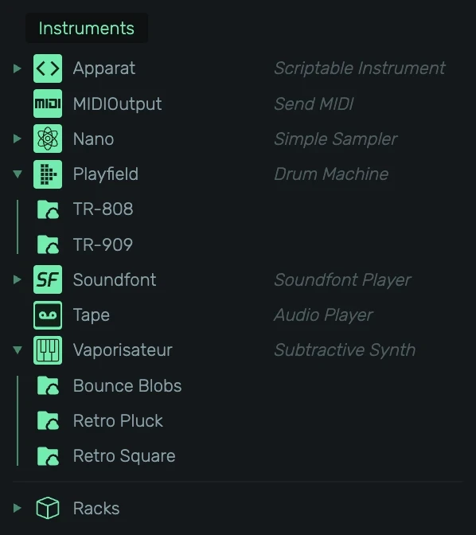
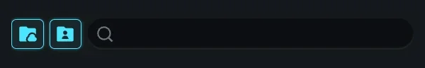
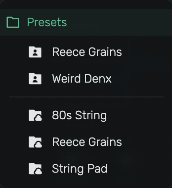
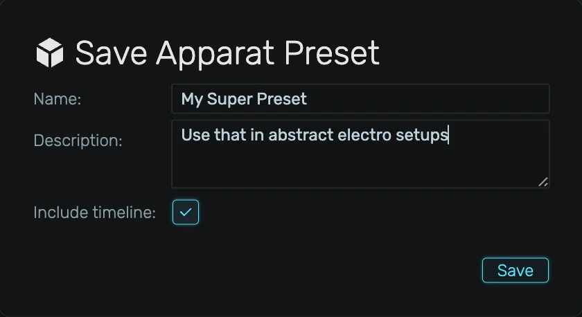
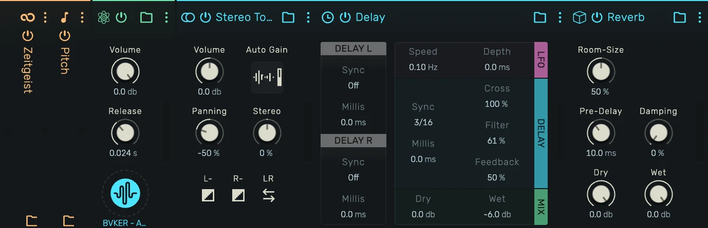
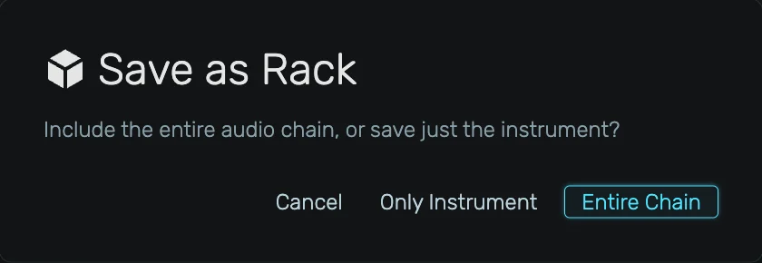
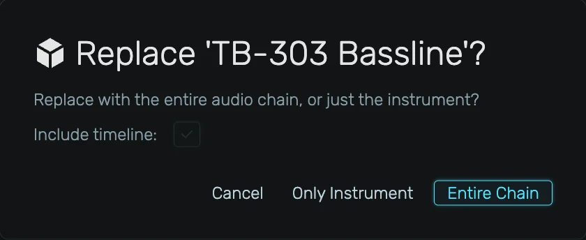
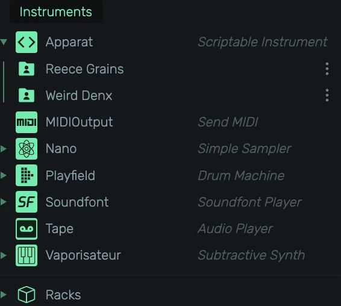

# Presets

The **Presets** tab in the Browser panel is where you create, organise, and reuse devices in openDAW.
A preset can be a single instrument, a single effect, a chain of effects (a *Chain*), or a complete
audio unit including its instrument, effects, mixer settings and, optionally, its automation timeline
(a *Rack*).

This manual covers how presets are organised, saved, and recalled.

## Where to find it

Open the **Browser** panel on the left side of the studio and switch to the **Presets** tab.

## The filter bar

At the top of the Preset browser there is a small filter bar with two toggles and a search field.

- **Cloud-folder icon**, shows or hides *stock* presets shipped with openDAW.
- **User-folder icon**, shows or hides *your own* presets stored locally.
- **Search field**, filters presets and devices by name. The search matches both preset names and
  the underlying device key, so typing `vaporisateur` will reveal every Vaporisateur preset and
  collapse everything else.

At least one of the two source toggles is always active. Disabling both at once is not allowed.

## How presets are organised

Presets are grouped into three colored categories.

- **Instruments** (green), plus a **Racks** row for full audio-unit presets.
- **Audio Effects** (blue), plus a **Chains** row for audio-effect chains.
- **MIDI Effects** (orange), plus a **Chains** row for MIDI-effect chains.

Each category lists one row per device. Click the triangle to expand its presets. The header shows
the device icon, name, and a brief description.

### Click an entry

Clicking a preset name creates it.

- **Instrument or Rack preset**, creates a new audio unit. No existing unit needs to be selected.
- **Effect or Chain preset**, appends the effect(s) to the selected audio unit's effect chain. If
  no audio unit is selected, openDAW asks you to select one first. MIDI presets are rejected on
  units that do not accept MIDI.

### Preset dropdown on the device header

Every device header carries a folder icon next to its name. Clicking it opens a dropdown listing
every preset registered for that device, user presets at the top, and stock presets below the
separator.

Pick an entry to load it in place on the currently selected device.

### Drag onto a track header

Drag an Instrument preset or a Rack preset onto the track header column (the empty area or between
existing tracks) to create a new audio unit at that position.

### Drag onto the device panel

Drag a preset onto the device panel of an existing audio unit.

- **Instrument preset** replaces the unit's instrument.
- **Rack preset** replaces the entire unit (only allowed on regular instrument units, not on busses).
- **Audio effect or Chain** is inserted into the audio-effect chain at the drop position.
- **MIDI effect or Chain** is inserted into the MIDI-effect chain at the drop position.

## Saving a preset

There are two ways to save a preset, both writing into the same local library.

1. **Drag** an existing device, chain, or audio unit into the Preset browser. The preset appears
   immediately under the matching device row. This is the recommended path, described in the rest
   of this section.
2. **Preset** submenu in the device's context menu (right-click on a device header). Entries vary
   by context but include *Save '…' as Preset*, *Save Entire Audio-Unit Chain*, and *Save Audio /
   MIDI Effect Chain*.

### Save a single instrument

Drag the instrument from its device panel header onto the matching device row in the **Instruments**
category. A *Save Preset* dialog opens with the device's current label as a suggested name. You can
optionally enable **Include timeline** to also store the audio unit's automation tracks, regions,
and clips together with the preset.

### Save a single effect

Drag a single effect from its device editor onto the matching device row in **Audio Effects** or
**MIDI Effects**. The save dialog appears without a timeline toggle, since effect presets never
carry timeline data.

### Save an effect chain (Chains)

Drag one or more effects onto the **Chains** row of the matching effect category. The dialog
suggests a name based on the first effect ("Compressor chain" for a multi-effect drag, or just the
effect's own label for a single one). Chains can hold a mix of different effect types, as long as
they all belong to the same category (audio or MIDI).

### Save a Rack (audio unit)

A Rack preset captures the entire audio unit: instrument, effects, mixer, send/return setup, and
optionally the timeline. To save one, drag the instrument onto the **Racks** row under Instruments.

There are two scenarios.

1. **You drag only the instrument.** openDAW asks how much you want to capture:
    - **Cancel**, abort.
    - **Only Instrument**, falls back to a normal instrument-preset save.
    - **Entire Chain**, saves the full audio unit as a Rack.
2. **You drag an effect together with its instrument** (multi-selection from the same audio unit):
   the dialog is skipped, only the selected effects are kept, and the Rack is saved straight away.

The Rack save dialog includes the **Include timeline** toggle.

### The "Include timeline" option

When enabled, the audio unit's tracks, regions, clips, and automation are encoded into the preset.
On load, openDAW recreates these timeline elements alongside the device. This lets you store
complete song-fragments (e.g. a finished drum bus, or a full lead with its melody) for re-use in
other projects.

The current state of this flag is shown in the preset list as a small **timeline badge** next to
the preset name.

## Replacing an existing preset

You can overwrite any **user** preset by dragging a matching device, chain, or rack onto the existing
preset entry. openDAW only highlights compatible drop targets, so if a target is not lit the drag
is rejected.

A confirmation dialog appears before the file is replaced. For instrument and rack presets the
dialog also exposes **Include timeline**, pre-filled with the current value of the existing preset
so subsequent edits do not silently flip the flag.

## Preset actions menu

Every **user** preset entry shows a small kebab menu (⋮) on the right side of its row. Stock
presets are read-only and do not show the menu.

Click the icon to reveal the per-preset actions.

- **Edit…**, change the preset's name and description.
- **Delete**, removes the preset from local storage. A confirmation prompt is shown first.

The menu sits inside the preset row, but its click is isolated, so opening the menu does not
activate the preset.

## Stock and user sources

- **Stock** presets are shipped with openDAW and cannot be edited or deleted. They are marked with
  the cloud-folder icon, loaded once per session, and cached.
- **User** presets live in your private OPFS storage and are included in **Cloud Backup** runs the
  same way projects and samples are.
- The first time you open the Preset browser in a session a small spinner is shown while the stock
  catalogue is fetched. Once cached, switching back to the tab is instant.